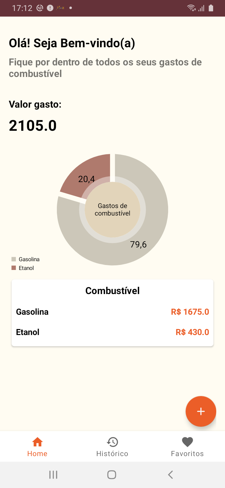
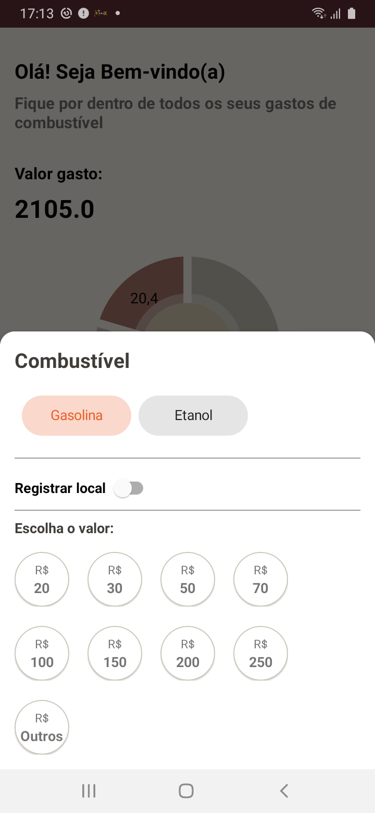
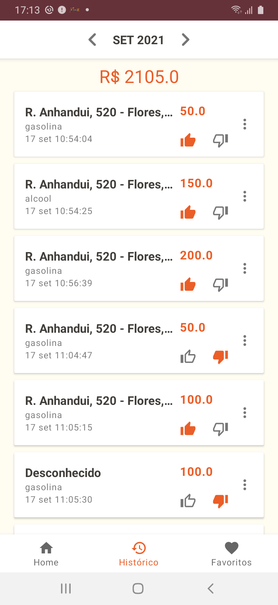

# gas-check-android
Aplicativo para controle e avaliação de combustível.

## Recursos utilizados

- Arquitetura MVVM.
- Clear architecture.
- ROOM (DataBase local).
- Navigation Component.
- Injeção de depência **KOIN**
- Custom View.

   &nbsp;&nbsp;
  &nbsp;&nbsp;
   &nbsp;&nbsp;   

